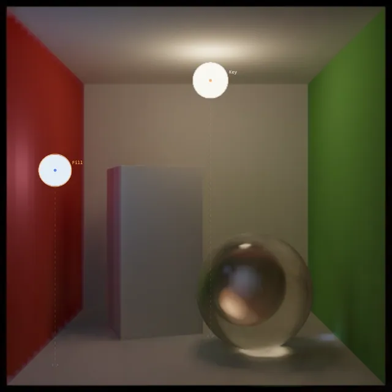
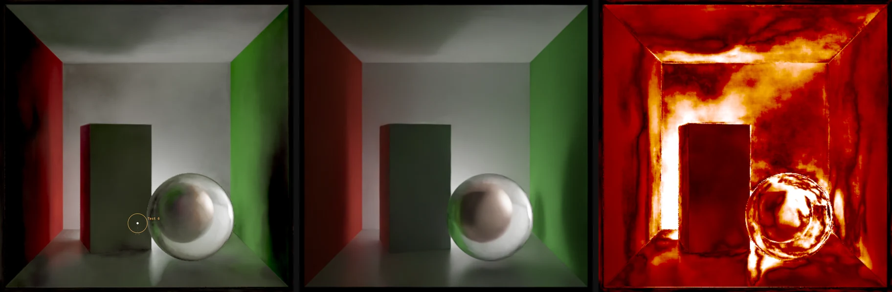

# Relight

Relight a path-traced scene in the browser in milliseconds. This is a re-implementation of *Neural Render Proxies for Interactive and Differentiable Lighting* (Sancho et al., EGSR 2026): a Python pipeline trains a small network per scene, and a WebGPU viewer (with a WebGL2 fallback) runs it for interactive relighting and "paint the light you want" inverse lighting.

**Live demo:** https://relight.harrison-martin.com



## Features

- Move, resize and recolour sphere lights and see indirect light update in real time (about 5 ms per light on an RTX 3080 at 512²)
- **Paint & Optimize:** paint the lighting you want, or load a target image, and gradient descent moves the lights to match
- **Accuracy tab:** compare the network against path-traced references for held-out lights
- WebGPU, with an automatic WebGL2 fallback for browsers without it (most phones)
- Two shipped models for the Cornell box: fast (128×4) and quality (256×4)

## Quick start

Requires Node.js 20.19+ (Vite 7).

```bash
npm install
npm run install:all
npm run dev              # open http://localhost:5173
```

The trained Cornell box models are included in `client/public/scenes/`, so no Python is needed to run the viewer.

### Other ways to run it

| command | what it does |
|---|---|
| `npm run lan` | also serves to phones and tablets on your network (WebGL2 there, since WebGPU needs HTTPS) |
| `npm run https` | same, over HTTPS with a self-signed certificate, so other devices get WebGPU. Accept the certificate warning once per device |
| `npm run build` | static build into `client/dist` |
| `docker compose up --build` | nginx serving the viewer on http://localhost:54890, API on 54891 |

On Windows, `lan` and `https` need Windows Firewall to allow Node on the network, and Windows only allows that for networks set to *Private*.

## Usage

| input | action |
|---|---|
| drag a light | move it across the image |
| mouse wheel | move the selected light in depth |
| Shift + wheel | change its radius |
| double-click a surface | place the selected light there |

### URL parameters

| parameter | effect |
|---|---|
| `?backend=webgpu` / `?backend=webgl` | force a backend (the header switch does the same and keeps your lights) |
| `?res=384` / `?res=768` | use a smaller or larger export of the scene (smaller is faster on weak GPUs; reference renders exist only at native size) |
| `?kernel=128x4` / `?kernel=o2` | force how the network runs: a WebGPU kernel shape (threads × pixels per thread) or WebGL2 output groups per pass; `?kernel=tune` times them again |

On slow GPUs, a moving light is previewed on every 2nd, 4th or 8th pixel, chosen from measured timings, and refined to full resolution about 150 ms after it stops.

On WebGPU the network runs in 16-bit floats where the GPU supports `shader-f16` (about a third faster, at most about 3/255 off), and at load the viewer times several kernel shapes and keeps the fastest (logged to the console). WebGL2 does the same for how many output groups each shader pass writes (on an RTX 3080, one a pass is about 30% faster than eight). The choice is remembered per GPU, so it is timed only on a first visit. Painting and optimizing stays in 32-bit floats.

## Train your own models

The Python pipeline needs an NVIDIA GPU with CUDA. Large files (the virtual environment and path dumps of about 2.5 GB per scene) live outside the repo in `%USERPROFILE%\relight-work`; set `RELIGHT_WORK` to use a different location.

```bash
python -m venv %USERPROFILE%\relight-work\venv
pip install torch --index-url https://download.pytorch.org/whl/cu124
pip install mitsuba numpy pillow "triton-windows<3.3" oidn usd-core
```

Optional but about 20× faster data generation: unpack the [OIDN 2.x Windows release](https://github.com/RenderKit/oidn/releases) into `%USERPROFILE%\relight-work`, or set `OIDN_DIR`.

```bash
cd nrp
python sample_paths.py --scene cornell --res 512 --spp 128      # ~1 min on an RTX 3080
python validate_gather.py                                       # optional sanity check
python train.py --geo --head mul --width 128 --hidden 4 --iters 100000 --name cornell_geo_128x4   # ~21 min
python export.py --run cornell_geo_128x4 --name cornell         # add --res N for other image sizes
python evaluate.py --runs cornell_geo_128x4                     # optional: score against 1024-spp references
```

Exports store their per-pixel buffers packed (16-bit positions, each row as differences), which gzip shrinks about 4.5x more than the old float layout. An export from before this can be repacked in place with `python pixels.py <web scene folder>`; the viewer reads both.

## Your own scene (USD)

Any USD stage (`.usd`, `.usda`, `.usdc`, `.usdz`) can replace the Cornell box. Pass the file to
`sample_paths.py`, and use the id it prints (the file name without extension, or `--name`) as the
scene for the other steps:

```
python sample_paths.py --scene D:\assets\kitchen.usdz --name kitchen [--camera /World/Cam]
python train.py --scene kitchen --geo --head mul --width 128 --hidden 4 --iters 100000
python export.py --run kitchen_128x4 --label "Kitchen · fast (128×4)"
```

The model then appears in the viewer's model menu (or open `?scene=kitchen`).

`nrp/examples/caustics_still_life.py` builds an example stage in code: glassware in a plaster niche, made to show off
caustics. Its docstring gives the settings it needs: more bounces for the wine glass, and smaller lights for sharper caustics.

What the import does (`usd_scene.py`):

- **Camera.** It uses the camera named with `--camera`, or else the first camera in the stage. Without a camera it frames all
  geometry from a three-quarter view. The image is square, so a wide camera is cropped to its smaller field of view.
- **Units and scale.** The stage is converted to Y-up, then moved and scaled so that the region the camera sees spans
  about [-1, 1]. The network's inputs, the light radius range and the path storage expect that scale. Light positions in the viewer are
  in these coordinates; `meta.json` records the transform (`normalize`) to map them back to the stage.
- **Light domain.** By default the lights live in the visible region. For enclosed scenes it is pulled in slightly, and when many camera rays
  escape (an object on a ground plane, say) it is grown by 0.3 so lights can go above and around things. The import prints it. Override it with
  `--light-bbox x0 y0 z0 x1 y1 z1` (normalised coordinates), `--light-margin` or `--radius-range`.
- **Geometry.** Meshes (polygons, holes, GeomSubsets with their own materials, vertex or faceVarying normals and UVs),
  the implicit Sphere, Cube, Cylinder, Cone, Capsule and Plane, native instances and PointInstancers are all imported. Subdivision surfaces
  render as their control cage. Invisible prims, guides and proxies are skipped, and so are curves, points and volumes.
- **Materials.** UsdPreviewSurface is converted in full: constant or textured colour, roughness, metallic and opacity, UsdTransform2d,
  normal maps, alpha cutouts (`opacityThreshold`), and glass (low opacity plus `ior`). MaterialX standard_surface / OpenPBR and OmniPBR / OmniGlass
  only get their constant values. Anything else falls back to `displayColor`. Emission is ignored, because the virtual lights are the only lights.
  Textures larger than `--max-texture` (2048) are downsampled.
- **Lights.** UsdLux lights don't take part in training, but sphere, disk, rect and cylinder lights become the viewer's starting lights
  (non-sphere ones as spheres of the same area). They keep their colours and relative intensities and are scaled for a good exposure.
  Without such lights, `export.py` picks a warm key and a cool fill that light the view well. It also picks the test lights for the Accuracy tab.

The import prints a summary and notes on anything it approximated or skipped. Check those first when something looks off.

The paper's limitations apply here too: one static stage, one camera, and sphere lights inside the light domain. Large, open or highly
detailed scenes spread the same network over more variation, so expect lower accuracy than on the Cornell box.
Keep the light domain tight, or train longer or wider.

## Project layout

```
nrp/                        Python: data generation and training (PyTorch, Mitsuba 3, Triton, OIDN)
  scenes.py                 emitter-free scenes and the light domain
  usd_scene.py              any USD stage as an emitter-free Mitsuba scene (see "Your own scene")
  sample_paths.py           SAMPLEPATHS: light-agnostic path dump
  gather.py                 GATHERLIGHT: fused Triton kernel for sphere lights
  direct.py                 analytic direct-view term
  denoise.py                OIDN 2 (CUDA via ctypes) with CPU fallback
  model.py / train.py       grid-encoded MLP and pool-based training
  export.py / evaluate.py   export for the viewer; accuracy against references
  pixels.py                 packs exported per-pixel buffers so they download small (repacks older exports)
client/                     React 19 + Vite + Tailwind CSS 4 viewer
  src/engine/shaders.js     WGSL: precompute, fused MLP forward, composite, loss, backward
  src/engine/nrp.js         WebGPU engine and Adam light optimizer
  src/engine/nrp-gl.js      WebGL2 fallback engine
  src/relight/relighter.js  lights, render loop, interaction, optimization
server/                     Express health-check API (the viewer itself is static)
```

## How it maps to the paper

| paper | here |
|---|---|
| §3.1 SAMPLEPATHS / GATHERLIGHT | `sample_paths.py` (Mitsuba 3, BSDF sampling without NEE, fp16 vertices) and `gather.py` (one Triton kernel) |
| §3.2 linearity | one network per light type; the viewer caches each light's contribution, so colour and intensity edits are free |
| §4.3 network | `model.py`; in 2D the hash grid never collides, so it is stored as dense multi-resolution grids |
| §4.4 training | `train.py`; pool of 300 denoised images, 2 replaced every 5 iterations, segment-based light sampling, relative MSE |
| §5.3 inverse lighting | `client/src/engine/nrp.js` with a hand-written WGSL backward pass |

**Deliberate deviations:** the directly visible light (segment 0) is computed analytically rather than learned, geometric per-light inputs and a multiplicative output head are added (+2 dB, 25% less error), and the networks are smaller (128×4 and 256×4 instead of 256×8) so they run interactively in a browser.

## Accuracy

Scored by `evaluate.py` against denoised 1024-spp references on 37 lights:

| model | PSNR | relative error | worst 5 lights | per light (RTX 3080, 512²) |
|---|---|---|---|---|
| `cornell` (fast, 128×4) | 44.0 dB | 4.4 % | 32.5 dB | 4.8 ms |
| `cornell-hq` (quality, 256×4) | 46.2 dB | 3.5 % | 34.1 dB | 17.1 ms |



Regions the camera's paths rarely reach, like the wall behind the tall box, are the least accurate (test 6 above).

## Limitations

- A proxy is trained for one static scene and one camera.
- Lights are valid only inside the training domain (`light_bbox`, `radius_range`); the viewer clamps them to it.
- Inverse lighting with several lights is non-convex. If it lands somewhere odd, press Undo, drag a light roughly into place and optimize again.

## Contributing

Issues and pull requests are welcome. Good places to start:

- **new scenes** in `nrp/scenes.py`
- more path samples for regions the camera rarely reaches

For changes to the network or training, please include `evaluate.py` numbers before and after.

## Further reading

A write-up of how this was built, and what the accuracy harness showed: [Relighting a Path-Traced Room in 5 ms](https://blog.harrison-martin.com/neural-render-proxies-in-the-browser).
